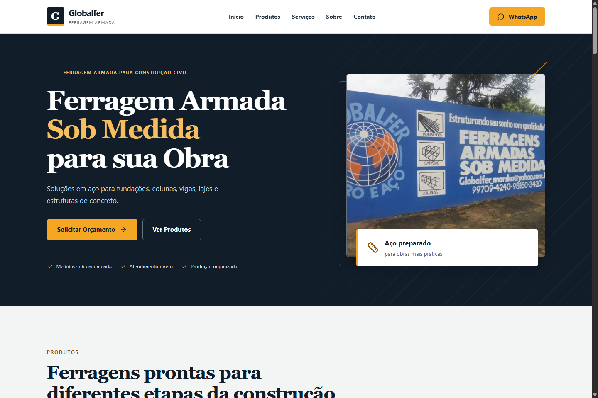
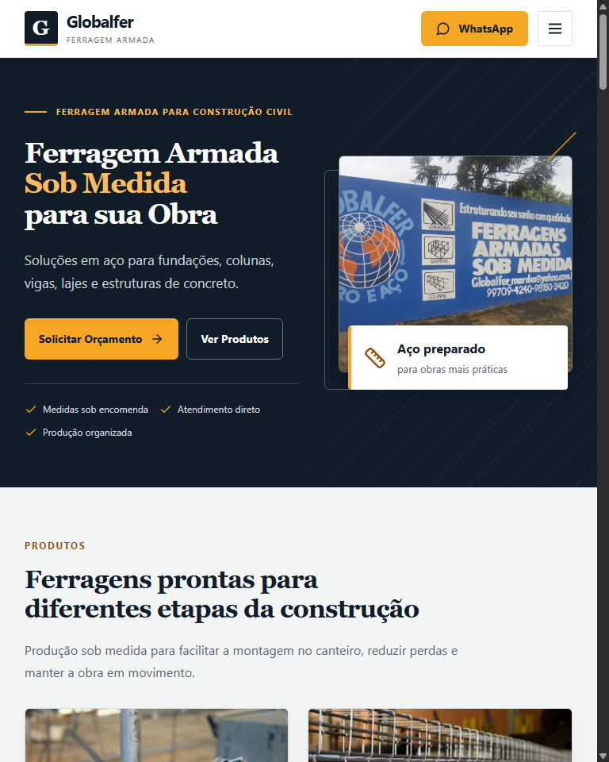
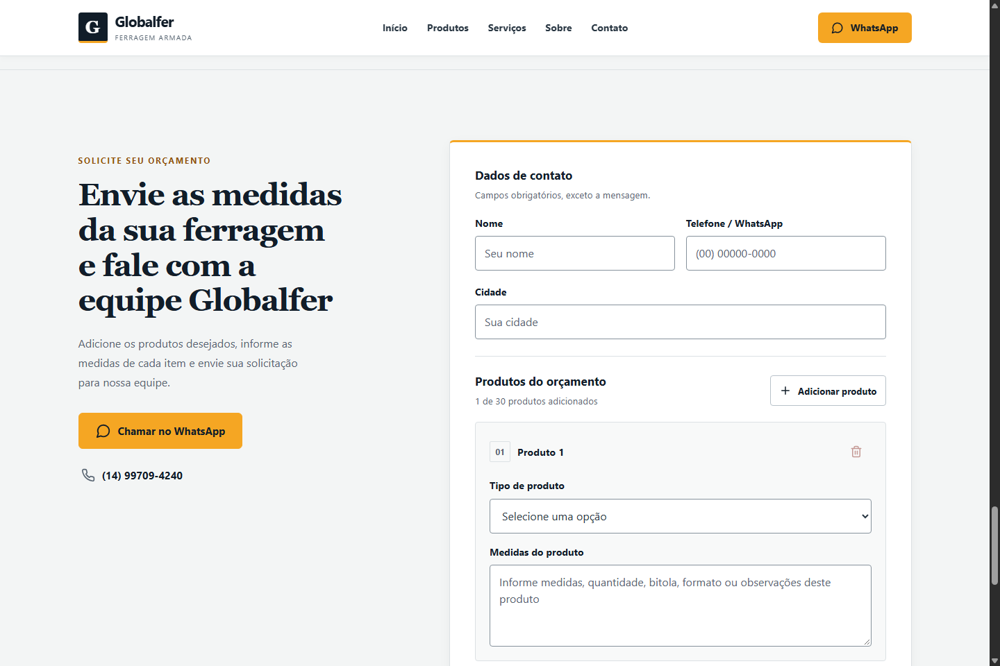

# Globalfer

**Ferragem armada sob medida para sua obra.**

The website for Globalfer, a construction steel and reinforcement supplier serving Marília and the surrounding region. Customers can explore products, learn about cutting and assembly services, and request a quote with the measurements for their project.

[Live website](https://globalfer-site.web.app/) · [Preview](#interface-preview) · [Run locally](#local-development) · [Configuration](#environment-variables) · [Testing](#testing) · [Deployment](#production-deployment) · [Security audit](SECURITY-AUDIT.md)

## Interface preview

Local browser captures of the visual refresh, using the existing Globalfer photographs and business content. These screenshots document the repository's UI; they are not a production deployment record. The quote form is empty, and no email was sent to capture these views.

**Desktop · 1440 px**



<details>
<summary>Tablet and mobile layouts</summary>

<table>
  <tr>
    <th>Tablet · 768 px</th>
    <th>Mobile · 390 px</th>
  </tr>
  <tr>
    <td><a href="docs/screenshots/tablet-home.png"></a></td>
    <td><a href="docs/screenshots/mobile-home.png"></a></td>
  </tr>
</table>

</details>

<details>
<summary>Quote form detail</summary>



</details>

Screenshots are stored in [`docs/screenshots/`](docs/screenshots/), outside the deployed frontend assets. Open an image to inspect it at full resolution.

## Main features

- Responsive product catalog with real photographs and descriptions of cutting, bending and assembly services.
- Accessible navigation, visible keyboard focus, reduced-motion support and direct WhatsApp contact.
- Quote form with up to 30 product items, individual measurements, validation and submission feedback.
- Server-controlled quote routing to two trusted business recipients.

## Tech stack

| Layer | Technologies |
| --- | --- |
| Frontend | React 18, Vite, CSS Modules, Lucide icons |
| API and email | Node.js 24, Express, Nodemailer |
| Hosting | Firebase Hosting for the frontend; Google Cloud Run for the API |
| Secrets | Google Secret Manager for the SMTP password |

The interface uses shared CSS tokens, system fonts and restrained transitions, with no external font or animation service.

## Architecture

```text
Firebase Hosting -- static frontend files --> Browser
Browser -- HTTPS via VITE_API_URL --> Cloud Run API -- SMTP --> Business recipients
```

The browser calls Cloud Run directly. Firebase Hosting has no API rewrite, and the Express backend is API-only: it does not serve the website or `dist/`.

| Production item | Current value |
| --- | --- |
| Frontend | [globalfer-site.web.app](https://globalfer-site.web.app/) |
| Backend | [globalfer-api-nxbq6byh4q-rj.a.run.app](https://globalfer-api-nxbq6byh4q-rj.a.run.app) |
| Google Cloud / Firebase project | `globalfer-site` |
| Cloud Run service / region | `globalfer-api` / `southamerica-east1` |
| Backend revision | `globalfer-api-00003-2kf` |
| Frontend build setting | `VITE_API_URL=https://globalfer-api-nxbq6byh4q-rj.a.run.app` |
| Backend allowed frontend origin | `FRONTEND_URL=https://globalfer-site.web.app` |
| Quote routing | Two trusted, server-controlled business recipients |

## Project structure

```text
src/
  components/   React page sections and quote form
  data/         Product and service content
  styles/       Global styles and CSS modules
public/assets/  Images and static files
server/
  index.js      Environment loading and server startup
  app.js        Express application, validation and quote email
  shutdown.js   Bounded draining on process termination
tests/          API, mail composition and shutdown tests
scripts/
  build-firebase.mjs  Hosting build configuration validation
docs/screenshots/  Desktop, tablet, mobile and quote-form previews
firebase.json   Hosting routes, headers and local emulator
.firebaserc     Public Firebase project mapping
Dockerfile      Nonroot Cloud Run backend image
SECURITY-AUDIT.md  Detailed security evidence and historical snapshots
```

## Local development

Use Node.js 24. From the repository root, install the locked dependencies and start the frontend and API:

```bash
npm ci
npm run dev
```

Open `http://127.0.0.1:5173/`. Vite proxies `/api` to Express on port 3001. Port 5173 is fixed to match the default `FRONTEND_URL`; `localhost` is a different browser origin. Leave `VITE_API_URL` unset locally to use this proxy. If changing ports, update the proxy and allowed origin together.

For frontend-only design work, use `npm run dev:client`; it starts Vite without the API. `npm run dev:server` starts the API with file watching, and `npm start` runs it without watching. SMTP settings are unnecessary for viewing the site, running tests or checking health; sending a quote requires working mail configuration.

## Environment variables

For local mail development, create an ignored `.env` using placeholders like these, then replace them with development settings and test inboxes you control. If using `.env.example`, replace its business recipient addresses before sending locally. Never copy production credentials into `.env` or commit credentials.

```dotenv
NODE_ENV=development
PORT=3001
FRONTEND_URL=http://127.0.0.1:5173
QUOTE_EMAIL_TO=first@example.com,second@example.com
SMTP_HOST=smtp.example.com
SMTP_PORT=465
SMTP_SECURE=true
SMTP_USER=mailer@example.com
SMTP_PASS=replace-with-development-password
SMTP_FROM="Globalfer development <mailer@example.com>"
```

| Variable | Meaning |
| --- | --- |
| `NODE_ENV` | `production` enables the backend production HSTS policy. |
| `PORT` | HTTP port; defaults to 3001 locally and is injected by Cloud Run. |
| `FRONTEND_URL` | Exact allowed browser origin, without a path or trailing slash. |
| `QUOTE_EMAIL_TO` | Comma-separated, trusted server-controlled recipient list. |
| `SMTP_HOST`, `SMTP_PORT` | SMTP provider hostname and port; required for sending. |
| `SMTP_SECURE` | Literal `true` enables TLS from connection start, as used with port 465. |
| `SMTP_USER`, `SMTP_PASS` | Provider login and password; required for sending. |
| `SMTP_FROM` | Provider-authorized sender; defaults to `SMTP_USER`. |

A nonempty `QUOTE_EMAIL_TO` replaces the entire repository fallback list; an absent or empty value uses the two business addresses in that fallback. Production explicitly configures its two trusted business recipients. Each quote uses one message and one `sendMail` call with both addresses in `To`, with no `Cc` or `Bcc`. `From` is configured on the server and `Reply-To` is `SMTP_USER`. Visitors cannot override these fields.

`.env` is for local development only. Production configuration lives in Cloud Run, with `SMTP_PASS` injected from the pinned Secret Manager version `SMTP_PASS:3`. The runtime identity has Secret Accessor on that specific secret. Keep the password out of files, images, logs and frontend builds.

`VITE_API_URL` is public build-time browser configuration, not a secret. `VITE_BASE_PATH` defaults to `/` and must remain `/` for Firebase builds. Never put credentials in any `VITE_*` variable.

## Testing

```bash
npm test
npm audit
npm audit --omit=dev
```

| Check | Latest verified result |
| --- | --- |
| `npm test` | 179 tests passing |
| `npm audit` | 0 vulnerabilities |
| `npm audit --omit=dev` | 0 vulnerabilities |
| `npm run build` | Passed |

These results were recorded during the visual refresh. Tests use fake SMTP behavior or compose messages in memory; they do not load `.env`, contact an SMTP provider or send email. See [SECURITY-AUDIT.md](SECURITY-AUDIT.md) for detailed security evidence and historical review records.

### Interface verification

The visual refresh was reviewed in Chrome at 1440, 1280, 1024, 768, 480, 390 and 320 px, with no horizontal overflow, broken images or console warnings. Checks covered keyboard navigation, sticky-header anchor offsets, text contrast and reduced motion.

Browser tests used mocked responses to check required fields, product add/remove controls and the 30-item limit, pending and error states, payload structure and successful form reset. No real quote request reached the API during these checks. The production SMTP test below is a separate, earlier verification.

### Production quote verification

One controlled dual-recipient production quote completed successfully through SMTP handoff:

- Exactly one valid quote was submitted, with no retry.
- The frontend displayed success and reset the form once.
- Exactly one matching Cloud Run POST returned HTTP 200.
- One Nodemailer `sendMail` call completed successfully, as indicated by the reviewed request path and successful response.
- Final Gmail inbox receipt has not been independently verified.
- Final Yahoo inbox receipt has not been independently verified.

**SMTP acceptance is not confirmed inbox delivery.** The API does not expose per-recipient acceptance, and a successful SMTP result can include partial recipient acceptance. The remaining manual check is to inspect the already submitted message in both inboxes; another quote is not needed for that check. This verification does not establish an exactly-once delivery guarantee.

## Build

For a local production-mode build and visual preview:

```bash
npm run build
npm run preview
```

Output goes to `dist/`. An ordinary build permits an unset `VITE_API_URL` for local review. A production Hosting build requires the explicit HTTPS Cloud Run origin and root base shown below; the build guard rejects missing or invalid API origins, the frontend's own origin, and an incompatible base path.

## Production deployment

Firebase Hosting and Cloud Run are live at the URLs above. Frontend and backend releases are separate, manual operations; no automatic deployment workflow is enabled. Updating this repository or its screenshots does not publish a new release.

### Frontend redeployment

With the Firebase CLI installed and authenticated for `globalfer-site`, use the following PowerShell commands for an authorized Hosting redeployment:

```powershell
$env:VITE_API_URL = 'https://globalfer-api-nxbq6byh4q-rj.a.run.app'
$env:VITE_BASE_PATH = '/'
npm run build:firebase
firebase deploy --only hosting --project globalfer-site
```

Keep these variables available to the Hosting predeploy hook, which validates configuration and rebuilds from source. Hosting publishes only `dist/`. SPA navigation excludes `/api` and its descendants, which return 404 on Hosting. Static responses have security headers and `Cache-Control: no-cache` so browsers revalidate cached files.

For local static review with the Hosting emulator:

```bash
npm run build
firebase emulators:start --only hosting --project globalfer-site
```

The emulator listens on `http://127.0.0.1:5000` with its UI disabled. Review navigation, assets, headers and API 404s there; use the development proxy for local API work. After redeployment, verify live navigation, assets and routing as well as the local build.

### Backend redeployment

The Dockerfile pins `node:24.21.0-bookworm-slim`, installs locked production dependencies and runs as the unprivileged `node` user. Its allowlisted build context excludes environment files, credentials and frontend output. Cloud Run supplies `PORT`; neither `.env` nor `dist/` is needed to start the API.

For local container checks without SMTP credentials:

```bash
docker build --platform linux/amd64 -t globalfer-api:local .
docker run --rm -p 127.0.0.1:8080:8080 -e PORT=8080 -e FRONTEND_URL=https://globalfer-site.web.app globalfer-api:local
```

Check health, rejected inputs and unknown routes only. For an authorized backend redeployment, run tests and audits, build a Linux amd64 image, publish it under a full-commit tag in `southamerica-east1-docker.pkg.dev/globalfer-site/globalfer/globalfer-api`, record its digest and update the existing service by that digest. Preserve the production environment, pinned secret, runtime identity, access model and resource settings unless a change is explicitly reviewed.

| Runtime setting | Current value |
| --- | --- |
| CPU / memory | 1 vCPU / 512 MiB |
| Minimum / service-level maximum instances | 0 / 1 |
| Concurrency / request timeout | 4 / 60 seconds |
| Execution / billing | Second generation / request-based |
| Runtime identity | `globalfer-api-runtime@globalfer-site.iam.gserviceaccount.com` |
| Access | Public invocation with the invoker IAM check disabled; all ingress |
| Non-secret environment | `NODE_ENV=production`, `SMTP_PORT=465`, `SMTP_SECURE=true`, exact `FRONTEND_URL` above |
| Secret reference | `SMTP_PASS:3`, never `latest` |

Keep `SMTP_HOST`, `SMTP_USER`, `SMTP_FROM` and the two-recipient `QUOTE_EMAIL_TO` in the existing server configuration. Do not place production SMTP values in frontend build settings. Deployment verification should use health and safe negative checks; valid production quotes send email and require separate authorization.

## Security overview

- Strict JSON validation rejects unknown fields, including visitor-supplied `to`, `cc` and `bcc`. Quotes allow 1–30 product items, bounded strings and at most 64 KiB of uncompressed JSON; compressed bodies are rejected.
- Visitor content is escaped in HTML email, and line breaks are rejected in the name used in the subject. Recipient, sender and reply routing remain server-controlled.
- Quote POSTs enforce the exact configured browser Origin. CORS is not authentication: requests without Origin remain allowed, and non-browser callers can forge it.
- Two shared process budgets limit request admission and mail attempts. `trust proxy=false`; forwarded IP headers do not create extra capacity.
- SMTP uses port 465 with TLS and certificate verification. Credentials remain in backend configuration and Secret Manager. If switching to port 587, review enforced STARTTLS first; the current `SMTP_SECURE=false` mode does not require it.
- Errors and application logs use fixed, safe messages rather than customer payloads, provider errors or credentials. Hosting and Express apply their own response security headers.

See [SECURITY-AUDIT.md](SECURITY-AUDIT.md) for detailed findings, validation evidence and historical deployment snapshots. Earlier snapshots describe their state at the time; the current production summary is above.

## API endpoints

These endpoints belong to Cloud Run, not Firebase Hosting.

| Endpoint | Behavior |
| --- | --- |
| `GET /api/health` | Returns `{ "ok": true }`; checks process availability without contacting SMTP. |
| `POST /api/orcamento` | Validates a JSON quote and sends one message to the configured recipient list. |

The quote schema accepts `name`, `phone`, `city`, optional `message`, and `items` containing `product` and `measurements`. Required strings must be nonempty. Limits are 120 characters for name, city and product; 40 for phone; 2,000 for message; and 1,000 for measurements. Unknown fields are rejected.

Responses include 200 for successful SMTP handoff, 400 for malformed or invalid input, 403 for a mismatched Origin, 413 for an oversized body, 415 for unsupported content type or compression, 429 for exhausted budgets with `Retry-After`, and a generic 500 for mail failures. Unknown routes, including `/` on the API host, return safe JSON 404 responses.

## Operational notes and limitations

- **Shared budgets:** each process admits up to 120 quote POST attempts per 60 seconds before Origin, type and body checks. It reserves up to 8 eligible mail attempts per 15 minutes after validation and before SMTP. Failed or ambiguous attempts are not refunded. A quote addressed to two recipients consumes one reservation; provider recipient quotas may count differently. Health, preflight and unknown routes are outside these budgets.
- **Availability:** limits are shared across callers, not keyed by user or IP. Invalid traffic can exhaust admission; plausible quotes can exhaust mail capacity. Counters reset on restart, fixed windows permit boundary bursts, and extra processes or overlapping revisions can multiply capacity. The service-level maximum is constrained to 1, but this is not a durable provider-wide quota.
- **Provider monitoring:** review aggregate provider quotas, rejection rates and delivery failures. The legacy Firebase function remains deployed and uses the same SMTP provider outside these counters. Do not assume this API's budgets cover all mail activity.
- **Delivery uncertainty:** SMTP handoff does not prove inbox delivery. HTTP timeouts or the eight-second shutdown drain can interrupt a request while mail work may still complete. Avoid automatic retries after an ambiguous submission; investigate the existing attempt first.
- **Health and logs:** `/api/health` checks process availability, not SMTP configuration, authentication or delivery. Review Cloud Logging access and retention because platform request metadata is separate from the application's safe log messages.
