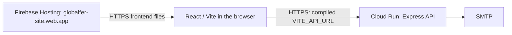

# Globalfer Website

Website for Globalfer, a construction steel and reinforcement supplier serving Marilia and the surrounding region.

The site presents the company, product catalog, services, business advantages, and a quote request form for customers who need cut, bent, or assembled steel products for construction work.

## Main Features

- Responsive React landing page for desktop and mobile.
- Product sections for rebar, columns, stirrups, trusses, wire, nails, and related steel products.
- Service sections for custom cutting, bending, and assembly.
- Contact and quote request form with multiple product line items.
- Express API endpoint for sending quote requests by email through SMTP.
- Static production build generated with Vite.
- Firebase Hosting configuration for the static frontend, with a separately hosted Express API.

## Tech Stack

- React 18
- Vite
- CSS Modules
- Express
- Nodemailer
- Firebase Hosting

## Project Structure

```text
src/
  components/   React sections used by the page
  data/         Product and service content
  styles/       Global styles and CSS modules
public/
  assets/       Images and static files copied into the build
server/
  index.js      Environment loading and server startup
  app.js        Express application and email quote API
  shutdown.js   Bounded HTTP draining on process termination
scripts/
  build-firebase.mjs  Deployment configuration validation and frontend build
firebase.json   Hosting files, navigation, headers and local emulator
.firebaserc     Public Firebase project mapping
Dockerfile      Non-root Cloud Run backend image
```

## Getting Started

Install dependencies:

```bash
npm ci
```

Run the React frontend and Express server together:

```bash
npm run dev
```

Frontend runs at `http://127.0.0.1:5173/`, and the API server runs from `server/index.js` on port 3001 by default. Vite keeps port 5173 fixed to match the default `FRONTEND_URL`; if occupied, stop the other process or configure both values together. Open the printed `127.0.0.1` URL, since `localhost` is a different browser origin. Leave `VITE_API_URL` unset locally to use Vite's existing `/api` proxy.

Use a supported Node release; this checkout was tested with Node 24.15.0 and npm 11.12.1. The compatibility floor for the automated tests is Node 18.13, but old end-of-life runtimes should not be used for production.

Run the API and mail-composition security tests:

```bash
npm test
```

Tests inject fake SMTP behavior or generate email in memory. They do not load `.env`, contact an SMTP provider, or send real email. See [SECURITY-AUDIT.md](SECURITY-AUDIT.md) for advisory details, validation results, proxy configuration, and non-OneDrive reproduction commands.

## Environment Variables

For local development, copy `.env.example` to `.env` and supply your development SMTP configuration before sending a quote. Production settings remain in Cloud Run and Secret Manager; do not copy production credentials into this file.

```bash
PORT=3001
FRONTEND_URL=http://127.0.0.1:5173
QUOTE_EMAIL_TO=globalfer_marilia@yahoo.com.br
SMTP_HOST=smtp.gmail.com
SMTP_PORT=465
SMTP_SECURE=true
SMTP_USER=seu-email@gmail.com
SMTP_PASS=sua-senha-de-app
SMTP_FROM="Site Globalfer <seu-email@gmail.com>"
```

The `.env` file is ignored by Git and should not be committed.

## Build

Create a production-mode build for local verification:

```bash
npm run build
```

The default Vite base is `/`. `VITE_BASE_PATH` remains available for special builds; Firebase builds require `/`. An ordinary build permits an unset `VITE_API_URL` for local visual review. Production Hosting builds use the verified Cloud Run origin through the build environment, as shown below.

Preview the production build locally:

```bash
npm run preview
```

## Deployment

Firebase Hosting now serves the React/Vite frontend connected directly to the existing Cloud Run Express API. The frontend migration was deployed and verified on 2026-09-22 UTC. One separately authorized production quote subsequently completed successfully through SMTP provider acceptance; final inbox delivery has not been independently verified by automation.



| Setting | Value/status |
|---|---|
| User-verified Firebase project | `globalfer-site` |
| Live frontend URL | `https://globalfer-site.web.app/` |
| Exact frontend origin | `https://globalfer-site.web.app` |
| Verified default Hosting site | `globalfer-site` |
| Backend platform | Google Cloud Run, service `globalfer-api`, region `southamerica-east1` |
| Backend HTTPS origin | `https://globalfer-api-nxbq6byh4q-rj.a.run.app` |
| Final Hosting version | `fc953ce63aaa0a00` (`FINALIZED`) |
| Final Hosting release | `1790039165331000` (`DEPLOY`), `2026-09-22T01:06:05.331Z` |

`.firebaserc` records only the verified default project ID. This public CLI mapping contains no credentials. No additional aliases or Hosting targets are configured.

The old GitHub Pages workflow and `.nojekyll` marker are removed from this branch. No replacement deployment workflow is enabled; this was a manual Hosting-only deployment. Local and remote `main` remain unchanged, and no merge occurred.

### Backend and build configuration

The backend must use exactly:

```text
FRONTEND_URL=https://globalfer-site.web.app
```

Use HTTPS with no path or trailing slash. The existing exact-origin checks remain unchanged. Keep SMTP credentials exclusively in the backend host's environment/secret storage.

The deployed frontend was compiled with `VITE_API_URL=https://globalfer-api-nxbq6byh4q-rj.a.run.app`, with no path or trailing slash. It submits to that origin's `/api/orcamento` endpoint. The value was supplied through the build process environment, without an environment-file edit or a hardcoded URL in `Contact.jsx`. `VITE_*` values are public browser configuration and must never contain secrets.

For an authorized manual redeployment, supply the public value in the current PowerShell session and keep it available to the Hosting predeploy hook:

```powershell
$env:VITE_API_URL = 'https://globalfer-api-nxbq6byh4q-rj.a.run.app'
$env:VITE_BASE_PATH = '/'
npm run build:firebase
firebase deploy --only hosting --project globalfer-site
```

`npm run build:firebase` validates that origin, rejects the Firebase frontend origin and an incompatible base path, then builds from source. Firebase's Hosting `predeploy` hook runs this command, so a missing/invalid API origin stops a normal CLI upload before publishing an old or unconfigured `dist`. In contrast, keeping `npm run build` available without a backend preserves local verification and development. No change to Contact.jsx is needed.

The backend is an API-only Node service on Cloud Run. `npm start` honors injected `PORT` (default 3001 locally); startup requires neither `.env` nor `dist`. Firebase Hosting serves production frontend files, and Vite serves them during local development. See the Cloud Run abuse controls and remaining operational limits below.

### Hosting behavior and local review

The checked-in Hosting configuration is deployed. The previous Hosting `/api/**` rewrite to the legacy Firebase function `api` in `us-central1` has been removed. That function itself remains unchanged. The current browser bundle calls Cloud Run directly; Hosting has no Cloud Run or Functions API rewrite.

`firebase.json` publishes only `dist`. Its positive RE2 navigation rule excludes the exact `/api` path and its descendants, while allowing normal SPA navigation, including `/a`, `/ap` and `/apiary`. The rule accepts slash and backslash separators because the Windows emulator normalizes paths differently from production. The upload ignore list also reserves `api` paths. The previous negated brace glob `!/api{,/**}` passed emulator checks but incorrectly served SPA HTML for live `/api` and `/api/orcamento`; replacing that single rewrite field resolved the discrepancy. Emulator and live checks now confirm API 404 responses. [Hosting configuration reference](https://firebase.google.com/docs/hosting/full-config)

Hosting sets `X-Content-Type-Options: nosniff`, `Referrer-Policy: strict-origin-when-cross-origin`, `X-Frame-Options: DENY` and `Permissions-Policy: camera=(), microphone=(), geolocation=()`. These protect static responses independently of Express. CSP is deferred pending a resource review. Firebase controls HSTS for `web.app`; no manual HSTS or custom-domain policy is added. [Hosting headers](https://firebase.google.com/docs/hosting/full-config#headers)

All static responses use `Cache-Control: no-cache`: browsers may store them but must revalidate, including HTML and SPA navigation. This conservative policy also covers `/assets/`, which mixes hashed bundles with unhashed public JPG/SVG images. Selective long-lived caching for hashed bundles is deferred; no blanket immutable policy risks retaining old images or HTML. The single header rule uses the supported `regex: ".*"`, avoiding a Windows CLI glob-normalization issue found during local validation. [Hosting cache behavior](https://firebase.google.com/docs/hosting/manage-cache)

With an installed Firebase CLI, build first, then use the Hosting-only local emulator:

```bash
npm run build
firebase emulators:start --only hosting --project globalfer-site
```

The configured listener is `http://127.0.0.1:5000`; the emulator UI is disabled. Check navigation, JS/CSS/images, headers, and API 404s. Do not use real quote delivery for this review. The authorized deployment reused existing CLI authentication. The production routing discrepancy above demonstrates why emulator success must be followed by live verification.

### Completed frontend verification

The final Hosting release contains 15 files, including `assets/index-BXYJZbLl.js`. **27 emulator and 27 live HTTP checks passed**: homepage/index, JS/CSS and all 12 images matched the build bytes; navigation and `/a`, `/ap`, `/apiary` returned the SPA; seven API-path cases returned 404. Static headers and `Cache-Control: no-cache` passed without a cache-policy change.

A live browser check against the same deployed bundle verified the homepage, five navigation links, 12 images and the empty quote form. A guarded invalid submission used the browser's natural production Origin, received OPTIONS 204 followed by POST 400, and displayed validation feedback. A separate wrong-Origin `{}` request returned 403. Expected cross-origin rejection from the local browser was also verified. Security headers were checked independently on Hosting and Cloud Run, including absence of backend `X-Powered-By`.

The five backend request records reviewed during Hosting deployment had statuses 200, 204, 400, 403 and 404, with no application payload logs. The backend configuration fingerprint, generation and revision `globalfer-api-00002-vbf`, `SMTP_PASS:3`, and legacy function remained unchanged by this Hosting deployment. Those deployment checks did not contact SMTP; the subsequent authorized production quote is recorded below.

### Controlled production quote verification

At **2026-09-22T01:25:06Z**, exactly one authorized production quote produced exactly one Cloud Run POST with HTTP **200**, one frontend success state and one form reset. Nodemailer completed successfully and the SMTP provider accepted the message. No retry or duplicate POST was observed, and the log review for that attempt found no sensitive information.

**Final inbox delivery was not independently verified by automation. No additional production quote or retry is authorized.** The remaining manual check is receipt of the already submitted message in the intended mailbox; provider acceptance alone does not establish inbox delivery.

### Future GitHub Actions authentication

Use Firebase CLI with Application Default Credentials supplied through Google Workload Identity Federation (GitHub OIDC) and a dedicated deploy service account. This avoids a persistent JSON key. Firebase documents ADC for CI; Google's auth action can generate the ADC file through federation. This combination is a recommended design, not an authenticated deployment tested here. [Firebase CLI CI authentication](https://firebase.google.com/docs/cli#cli-ci-systems), [Google auth action](https://github.com/google-github-actions/auth)

Before adding a deployment workflow, an administrator must:

1. Verify the actual Hosting site, Google project number, workload identity provider resource and dedicated service-account email. Enable the Hosting API and federation prerequisites (IAM, Resource Manager, Service Account Credentials and Security Token Service APIs).
2. Create the GitHub OIDC provider with issuer `https://token.actions.githubusercontent.com/`. Map the subject and required claims; restrict trust to the verified numeric repository/owner IDs and `refs/heads/main`. Grant only that repository's federated identity `roles/iam.workloadIdentityUser` on the deploy service account. Use real project numbers and identifiers; none are supplied here. [Google federation setup](https://docs.cloud.google.com/iam/docs/workload-identity-federation-with-deployment-pipelines)
3. Grant that account the documented Hosting permissions, `roles/firebasehosting.admin` and `roles/serviceusage.apiKeysViewer`, on the target Firebase project. Avoid Owner/Editor roles. [Firebase Hosting roles](https://firebase.google.com/docs/projects/iam/roles-predefined-product#hosting)
4. Protect the production GitHub environment and deployment branch. Give only the deploy job `contents: read` and `id-token: write`. Check out, build and verify first, then authenticate using the verified provider/account values and a reviewed version of `google-github-actions/auth`; use a maintained Node release. Keep credential-file creation and environment export enabled so Firebase CLI receives ADC. Its temporary ADC file is covered by `gha-creds-*.json` in `.gitignore` and must never be uploaded as an artifact.

Do not use `firebase init hosting:github` for this approach: its generated integration creates and stores a service-account JSON key as a GitHub secret. The manual Hosting deployment did not create GitHub federation, service-account keys, repository secrets or an automated workflow. [Firebase generated GitHub integration](https://firebase.google.com/docs/hosting/github-integration)

Future deployments and authentication changes require their own authorization. The completed manual Hosting release and existing Cloud Run deployment are recorded above and below.

## Backend deployment — Cloud Run

Cloud Run service `globalfer-api` is deployed in project `globalfer-site`, region `southamerica-east1`, at `https://globalfer-api-nxbq6byh4q-rj.a.run.app`. The live Firebase frontend at `https://globalfer-site.web.app/` now calls this backend directly. Runtime changes use immutable full-commit image tags in the existing regional Artifact Registry and deployment by digest. The Hosting migration preserved the backend revision, configuration and access model.

### Runtime and container

The backend now serves only the API: `/`, `/index.html`, asset paths and unknown routes return safe JSON 404 responses. Static `dist/` serving and the SPA fallback were removed, with regressions for those paths. `npm run dev` still uses Vite on `127.0.0.1:5173` and its unchanged `/api` proxy to Express on port 3001. `npm start` alone no longer serves the website.

`app.listen(port)` remains unchanged. Node's omitted host is an unspecified interface rather than loopback; the Linux container must be reachable through its IPv4 interface. Cloud Run supplies `PORT` (normally 8080); the code uses that value without hardcoding a Cloud Run port, retaining 3001 only as the local fallback. Cloud Run terminates public TLS before forwarding HTTP to the container. [Cloud Run container contract](https://docs.cloud.google.com/run/docs/container-contract)

The Dockerfile uses the official maintained Node 24 LTS image `node:24.21.0-bookworm-slim`, installs the committed lockfile with `npm ci --omit=dev --ignore-scripts`, copies only backend runtime files and runs as the unprivileged `node` user. Its direct Node command receives termination signals. `.dockerignore` allows only the Docker files, package manifests and runtime modules, excluding credentials, `.env*`, host dependencies, frontend/build outputs, tests, logs and Git/editor metadata. The shared manifest still includes some frontend production dependencies; splitting it is outside this task. [Official Node image](https://github.com/nodejs/docker-node/tree/main/24/bookworm-slim)

An explicit image avoids Google's source buildpack automatically executing this repository's Vite `build` script. A future buildpack alternative would need deliberate Node-version/entrypoint selection and `GOOGLE_NODE_RUN_SCRIPTS` configured to skip that frontend build. The broad package engine range is retained for compatibility; the Dockerfile pins the intended production runtime. A patch tag does not freeze the underlying image forever: record the tested immutable image digest at publication and rebuild for security updates. [Node buildpacks](https://docs.cloud.google.com/docs/buildpacks/nodejs)

For local container verification only:

```bash
docker build --platform linux/amd64 -t globalfer-api:cloud-run-prep .
docker run --rm -p 127.0.0.1:8080:8080 -e PORT=8080 -e FRONTEND_URL=https://globalfer-site.web.app globalfer-api:cloud-run-prep
```

This deliberately supplies no SMTP credentials: test only health, rejected inputs and 404s. Never pass production credentials as build arguments or bake them into an image.

On SIGTERM/SIGINT, the server stops accepting connections and drains active requests for up to eight seconds before forcing shutdown. Cloud Run's normal termination window is ten seconds. Mail delivery can still be interrupted because an SMTP stage may exceed the drain window; neither shutdown handling nor an HTTP timeout guarantees exactly-once delivery. [Shutdown contract](https://docs.cloud.google.com/run/docs/container-contract#instance-shutdown)

### Exact backend environment inventory

These ten variables are read by the backend; the examples are formats or public settings, never actual credentials. Only `SMTP_HOST`, `SMTP_PORT`, `SMTP_USER` and `SMTP_PASS` are checked for nonempty values before sending. Startup and health intentionally do not validate mail configuration.

| Variable | Required | Secret | Example format | Purpose |
|---|---|---|---|---|
| `PORT` | Injected by Cloud Run; optional locally | No | Integer supplied by the platform | HTTP listener; local default 3001 |
| `NODE_ENV` | Set to `production` on Cloud Run | No | `production` | Enables production HSTS policy |
| `FRONTEND_URL` | Explicitly set in production | No | `https://globalfer-site.web.app` | Exact allowed browser origin; local default `http://127.0.0.1:5173` |
| `QUOTE_EMAIL_TO` | Optional in code; explicitly confirm for production | No; business mailbox | Recipient email address | Fixed server-controlled destination; code has the existing business-mailbox default |
| `SMTP_HOST` | Required for sending | Normally non-secret configuration | Provider SMTP DNS hostname | Outbound mail server |
| `SMTP_PORT` | Required for sending | No | `465` for the proposed TLS mode | SMTP TCP port |
| `SMTP_SECURE` | Optional in code; set `true` for proposed port 465 | No | Literal `true` | TLS from connection start; any other value currently means false |
| `SMTP_USER` | Required for sending | Sensitive login identity; not usually an authentication secret by itself | Provider-authorized mailbox/login | SMTP authentication, fixed Reply-To and fallback sender |
| `SMTP_PASS` | Required for sending | **Yes** | Provider-issued password/app-password | SMTP authentication secret |
| `SMTP_FROM` | Optional; falls back to `SMTP_USER` | No; sender identity | Mailbox or display-name mailbox format | Provider-authorized From header |

Production reuses the verified existing Firebase function's SMTP host, user and authorized sender. `QUOTE_EMAIL_TO` was reused from existing production Firebase function configuration, rather than the repository fallback. `SMTP_PASS` is injected from the existing Secret Manager version **`SMTP_PASS:3`**, never `latest`. The runtime identity `globalfer-api-runtime@globalfer-site.iam.gserviceaccount.com` has Secret Accessor on that specific secret, with no project-wide Secret Manager grant. No password was read, copied into `.env`, duplicated or rotated. Keep production configuration in the platform; the local development example above does not authorize copying production credentials. Do not set a service-account JSON key or `GOOGLE_APPLICATION_CREDENTIALS` in the container. [Cloud Run secret injection](https://docs.cloud.google.com/run/docs/configuring/services/secrets)

`VITE_API_URL` and `VITE_BASE_PATH` are frontend build settings, not backend variables. The deployed frontend uses the verified Cloud Run origin supplied through its build environment; no permanent environment-file setting was added.

### Public access, client IP and abuse controls

The deployed service allows external ingress and public invocation through its disabled invoker IAM check. This previously authorized access model is preserved. Browser code must not contain Google credentials. The endpoint relies on validation, body limits, fixed recipients, SMTP protections and layered abuse controls. CORS alone is not authentication: non-browser requests can omit or forge Origin, and the existing no-Origin behavior remains allowed.

`trust proxy` remains **false**, and rate limiting no longer reads `request.ip` or the socket address. Express defines that IP as the immediate peer when trust is disabled. Google's external Application Load Balancer appends client/load-balancer addresses after an unverified caller-supplied `X-Forwarded-For` prefix, but that documented topology is not a fixed suffix contract for direct `run.app` ingress. Cloud Run documents TLS termination and proxying without establishing a safe exact client-IP extraction rule for this service. No authenticated alternative client-IP field was established in the reviewed runtime documentation. Do not enable `true`, select an arbitrary hop count or transplant the load-balancer positions. See the option comparison and historical Google sample caveat in [SECURITY-AUDIT.md](SECURITY-AUDIT.md). [Express proxy guidance](https://expressjs.com/en/guide/behind-proxies/), [Google forwarding headers](https://docs.cloud.google.com/load-balancing/docs/https#x-forwarded-for_header), [Cloud Run transport contract](https://docs.cloud.google.com/run/docs/container-contract#transport_layer_encryption_tls)

Two explicit fixed-window budgets replace the accidental per-proxy quota:

- **120 quote POST attempts per 60 seconds per process**, checked before Origin/type/body parsing. Rejected inputs count against this short budget, bounding repeated parser work without spending mail capacity.
- **8 mail attempts per 15 minutes per process**, reserved only after Origin/type/body/schema validation and before starting SMTP. Failed or ambiguous attempts are not refunded. The reservation is synchronous, so concurrent requests cannot pass the cap while earlier mail is pending.

Both use a monotonic clock and return JSON 429 with `Retry-After`. Health, preflight and unknown routes remain outside quote budgets. No IP/customer data is retained by the counters or added to logs. `X-Forwarded-For`, `X-Real-IP` and `Forwarded` never affect admission: IPv4, IPv6, malformed address strings and multiple apparent peers cannot create extra capacity. HTTP syntax errors can also be rejected by Node before Express.

This is a conservative aggregate mitigation, not per-customer fairness or DoS protection. Invalid traffic can exhaust the short request budget; eight plausible quotes can still deny mail capacity to others. The initial 120/minute ceiling permits modest rejected traffic without increasing the eight-attempt SMTP exposure. Fixed windows allow boundary bursts; restarts, additional processes and overlapping revisions reset or multiply capacity. Maximum instances = 1 reduces exposure but is not a durable provider-wide quota. The unchanged legacy Firebase function also shares the SMTP provider outside these counters. A monitored low-volume frontend connection can use this mitigation, but broader availability requires reviewed provider/day quotas and monitoring. The controlled quote established SMTP acceptance for one attempt; provider-wide quota enforcement and monitoring remain unverified.

Existing fixed recipients, 64 KiB bodies, strict validation and Origin checks remain. A global cooldown would delay unrelated customers; client-chosen identifiers would be bypassable. A honeypot would require coordinated form/schema changes and is only a weak supplementary signal. Neither is added, and no CAPTCHA, Redis or database is introduced. Provider-wide monitoring and a separately reviewed edge/shared quota design are the next controls if abuse appears or scaling is planned.

Future options include a shared rate-limit store, edge controls, or Cloud Armor behind an external Application Load Balancer. Cloud Armor requires a deliberately configured ingress path that prevents bypass through the direct service URL; it is not automatically attached to an ordinary Cloud Run URL or Firebase rewrite. No external datastore or edge infrastructure is added here.

### SMTP, health and logging

Production uses **465 with `SMTP_SECURE=true`**. Certificate validation stays enabled. Google documents SMTP use with Cloud Run and 465/587 are standard alternatives to externally restricted port 25. The controlled quote verified provider connectivity, SMTP authentication and message acceptance with the existing production configuration. It did not independently establish final inbox delivery, provider-wide quotas or the behavior of other VPC egress/firewall configurations. Default egress addresses are not fixed; a provider requiring IP allowlisting needs a separate egress design. [Google SMTP example](https://docs.cloud.google.com/build/docs/configuring-notifications/configure-smtp), [network restrictions](https://docs.cloud.google.com/firewall/docs/firewalls), [static egress](https://docs.cloud.google.com/run/docs/configuring/static-outbound-ip)

Port 587 with `SMTP_SECURE=false` currently uses opportunistic STARTTLS because the transport does not set `requireTLS`. Do not describe that mode as enforced encryption. If 587 is required, prepare and test a fail-closed STARTTLS policy before deployment. Existing DNS/connection/greeting timeouts are 10 seconds and socket timeout is 20 seconds; provider failures remain generic, HTML is escaped, sender/recipient fields stay server-controlled and the subject uses the validated visitor name. Never disable certificate checks. [Nodemailer TLS behavior](https://nodemailer.com/smtp#tls-options)

`GET /api/health` returns only `{ "ok": true }`, requires no SMTP configuration or connection, and stays outside the quote quota. It measures process availability, not mail delivery. It is suitable for a future HTTP startup/liveness probe; choose probe timing and billing explicitly before deployment, since periodic probes affect CPU allocation/cost. This task does not configure a probe or billing setting.

Cloud Logging collects stdout/stderr, so fixed categories such as `[mail] delivery_failed` and `[server] request_failed` remain useful. Startup/shutdown also log fixed categories. No request bodies, customer details, provider errors or environment values are added to application logs. Platform request logs separately contain HTTP metadata; review access/retention and aggregate error/rate-limit monitoring. Structured logging can be added later if severity/metrics need it. [Cloud Run logging](https://docs.cloud.google.com/run/docs/logging)

### Current service settings

| Setting | Deployed value |
|---|---|
| Project / service | `globalfer-site` / `globalfer-api` |
| Region | `southamerica-east1` (São Paulo) |
| Image/runtime | Reviewed Linux amd64 image from the Dockerfile; Node 24 LTS, non-root |
| Port | Cloud Run-injected `PORT`; platform default 8080, not fixed in application code |
| CPU / memory | 1 vCPU / 512 MiB |
| Minimum / service-level maximum instances | 0 / 1 for the initial monitored pilot |
| Maximum concurrent requests per instance | 4 |
| Request timeout | 60 seconds |
| Billing / execution environment | Request-based / second generation |
| Health | `/api/health`; no SMTP readiness probe |
| Runtime identity | `globalfer-api-runtime@globalfer-site.iam.gserviceaccount.com` |
| Invocation / ingress | Public through disabled invoker IAM check / all ingress |

These conservative settings are preserved by the rate-limit update; they are not guaranteed quotas. Maximum instances may briefly be exceeded, including during revision transitions. A Cloud Run request timeout may end the HTTP response without canceling mail work; avoid automatic retries of an ambiguous quote submission. [Scaling limits](https://docs.cloud.google.com/run/docs/configuring/max-instances), [request timeouts](https://docs.cloud.google.com/run/docs/configuring/request-timeout)

**Region:** the authorized deployment uses `southamerica-east1` (São Paulo), near Globalfer's Brazilian customers. Firebase Hosting does not force a US backend. [Cloud Run locations](https://docs.cloud.google.com/run/docs/locations), [Hosting integration regions](https://firebase.google.com/docs/hosting/cloud-run)

### Direct API versus a future Hosting rewrite

| Aspect | Direct `VITE_API_URL` — currently deployed | Later Hosting `/api/**` rewrite |
|---|---|---|
| Browser origin | Cross-origin; retain exact backend CORS/Origin checks | Same frontend origin simplifies browser CORS; backend Origin validation still matters |
| Configuration | Use the verified Cloud Run HTTPS origin and rebuild frontend | Requires actual service ID/region, API rules before SPA fallback, and revisiting the separate-origin build guard |
| Abuse controls | Explicit process budgets; no trusted client identity | Extra routing layer does not solve client attribution or aggregate limits |
| Visibility | Cloud Run URL is publicly callable | Rewrite alone does not hide or authenticate the underlying service |
| Caching/timeouts | No Hosting CDN on API path; Cloud Run timeout applies | Verify API `no-store` behavior, including error responses; Hosting has its own 60-second timeout |
| Operations | Current frontend calls the existing backend; deployments remain separate | Adds routing/revision coordination and an additional failure/cache layer |

The deployed Firebase configuration has no API rewrite. Google's documented Hosting integration uses public Cloud Run invocation; it should not be mistaken for an authenticated reverse proxy. A future rewrite needs dedicated routing/cache tests and a reviewed ingress model. [Firebase Cloud Run integration](https://firebase.google.com/docs/hosting/cloud-run), [Hosting cache behavior](https://firebase.google.com/docs/hosting/manage-cache)

### Subsequent deployments and mail verification

The backend's region, registry, runtime identity, public access, secret version and resource settings were separately authorized and applied. Existing billing/APIs were verified; local Docker builds do not require a Cloud Build job. The completed Hosting migration reused that service without changing its image, revision, runtime configuration or secret access. New infrastructure or provider changes require separate review.

For subsequent authorized work:

1. Review the aggregate budgets above and provider/day monitoring; preserve the exact backend `FRONTEND_URL=https://globalfer-site.web.app` and frontend API origin.
2. Run required tests and audits, build from source, and review the generated frontend before an authorized Hosting-only deployment. Repeat emulator and live navigation, asset, header, API-routing and safe invalid-submission checks afterward.
3. Manually confirm receipt of the already submitted controlled message in the intended mailbox. No additional quote or retry is authorized. Continue monitoring rejection rates and aggregate SMTP quota.

Frontend connection and Hosting deployment are complete. The one controlled quote confirmed successful Nodemailer completion and SMTP provider acceptance; final inbox delivery remains the outstanding manual verification. Health and invalid-input checks alone do not establish mail delivery. Automated tests and safe live rejection checks use no SMTP network access.

## API Endpoints

- `GET /api/health` returns a basic health check.
- `POST /api/orcamento` validates a quote request and sends it to the configured email address.

The quote endpoint requires the SMTP environment variables listed above.

These endpoints belong to Express, not Firebase Hosting. Production uses `FRONTEND_URL=https://globalfer-site.web.app` and the real API origin in frontend `VITE_API_URL`. Quote submissions with a different browser Origin remain rejected.
