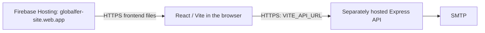

# Globalfer Website

Website for Globalfer, a construction steel and reinforcement supplier serving Marilia and the surrounding region.

The site presents the company, product catalog, services, business advantages, and a quote request form for customers who need cut, bent, or assembled steel products for construction work.

## Main Features

- Responsive React landing page for desktop and mobile.
- Product sections for rebar, columns, stirrups, trusses, wire, nails, and related steel products.
- Service sections for custom cutting, bending, and assembly.
- Contact and quote request form with multiple product line items.
- Express API endpoint for sending quote requests by email through SMTP.
- Static production build generated with Vite.
- Firebase Hosting configuration for the static frontend, with a separately hosted Express API.

## Tech Stack

- React 18
- Vite
- CSS Modules
- Express
- Nodemailer
- Firebase Hosting

## Project Structure

```text
src/
  components/   React sections used by the page
  data/         Product and service content
  styles/       Global styles and CSS modules
public/
  assets/       Images and static files copied into the build
server/
  index.js      Environment loading and server startup
  app.js        Express application and email quote API
scripts/
  build-firebase.mjs  Deployment configuration validation and frontend build
firebase.json   Hosting files, navigation, headers and local emulator
.firebaserc     Public Firebase project mapping
```

## Getting Started

Install dependencies:

```bash
npm ci
```

Run the React frontend and Express server together:

```bash
npm run dev
```

Frontend runs at `http://127.0.0.1:5173/`, and the API server runs from `server/index.js` on port 3001 by default. Vite keeps port 5173 fixed to match the default `FRONTEND_URL`; if occupied, stop the other process or configure both values together. Open the printed `127.0.0.1` URL, since `localhost` is a different browser origin. Leave `VITE_API_URL` unset locally to use Vite's existing `/api` proxy.

Use a supported Node release; this checkout was tested with Node 24.15.0 and npm 11.12.1. The compatibility floor for the automated tests is Node 18.13, but old end-of-life runtimes should not be used for production.

Run the API and mail-composition security tests:

```bash
npm test
```

Tests inject fake SMTP behavior or generate email in memory. They do not load `.env`, contact an SMTP provider, or send real email. See [SECURITY-AUDIT.md](SECURITY-AUDIT.md) for advisory details, validation results, proxy configuration, and non-OneDrive reproduction commands.

## Environment Variables

Copy `.env.example` to `.env` and fill in the SMTP values before using the quote email endpoint.

```bash
PORT=3001
FRONTEND_URL=http://127.0.0.1:5173
QUOTE_EMAIL_TO=globalfer_marilia@yahoo.com.br
SMTP_HOST=smtp.gmail.com
SMTP_PORT=465
SMTP_SECURE=true
SMTP_USER=seu-email@gmail.com
SMTP_PASS=sua-senha-de-app
SMTP_FROM="Site Globalfer <seu-email@gmail.com>"
```

The `.env` file is ignored by Git and should not be committed.

## Build

Create a production-mode build for local verification:

```bash
npm run build
```

The default Vite base is `/`. `VITE_BASE_PATH` remains available for special builds; Firebase builds require `/`. An ordinary build deliberately permits an unset `VITE_API_URL` while the separate backend is being prepared. That build is suitable for visual review, but its quote form cannot deliver mail on Firebase Hosting until the API origin is configured.

Preview the production build locally:

```bash
npm run preview
```

## Deployment

Firebase Hosting serves the React/Vite frontend. Express runs separately and sends quote requests through SMTP.



| Setting | Value/status |
|---|---|
| User-verified Firebase project | `globalfer-site` |
| Intended frontend URL | `https://globalfer-site.web.app/` |
| Exact frontend origin | `https://globalfer-site.web.app` |
| Verified default Hosting site | `globalfer-site`, confirmed by the installed CLI's read-only site lookup during emulator startup |
| Backend provider and HTTPS origin | Not selected or deployed in this task |

`.firebaserc` records only the verified default project ID. This public CLI mapping is appropriate to commit and contains no credentials. No additional aliases or Hosting targets are configured. No previous Firebase configuration was found in this clone, its ignored project files, or its nine-commit history before this correction; these are newly prepared files, not a recovered deployment record.

The old GitHub Pages workflow and `.nojekyll` marker are removed from this branch. No replacement deployment workflow is enabled. The existing `main` branch and remote hosting settings have not been changed; human review and merge are separate actions.

### Backend and build configuration

The backend must use exactly:

```text
FRONTEND_URL=https://globalfer-site.web.app
```

Use HTTPS with no path or trailing slash. The existing exact-origin checks remain unchanged. Keep SMTP credentials exclusively in the backend host's environment/secret storage.

After obtaining the real backend HTTPS origin, set `VITE_API_URL` to that origin in the frontend build environment, with no path or trailing slash. Its actual value is intentionally absent from this repository. `VITE_*` values are public browser configuration and must never contain secrets.

`npm run build:firebase` validates that origin, rejects the Firebase frontend origin and an incompatible base path, then builds from source. Firebase's Hosting `predeploy` hook runs this command, so a missing/invalid API origin stops a normal CLI upload before publishing an old or unconfigured `dist`. In contrast, keeping `npm run build` available without a backend preserves local verification and development. No change to Contact.jsx is needed.

The backend is generally suitable for a managed Node host: `npm start` honors injected `PORT` (default 3001), listens without restricting the host to loopback, uses portable paths, and reads SMTP settings from the environment. Startup does not require a local `.env` or `dist`; the optional static frontend fallback does need `dist/index.html` if used. Select and test a provider separately, including outbound SMTP access, exact proxy trust and shared/aggregate rate limits and mail quotas. Proxy trust remains unchanged.

### Hosting behavior and local review

`firebase.json` publishes only `dist`. Its SPA rewrite uses `!/api{,/**}`: navigation receives `index.html`, while `/api`, `/api/` and deeper API paths are excluded and return 404. The upload ignore list also reserves `api` paths. A missing `VITE_API_URL` therefore produces a failed quote request rather than a successful HTML response masquerading as the API. No backend rewrite is configured. [Hosting configuration reference](https://firebase.google.com/docs/hosting/full-config)

Hosting sets `X-Content-Type-Options: nosniff`, `Referrer-Policy: strict-origin-when-cross-origin`, `X-Frame-Options: DENY` and `Permissions-Policy: camera=(), microphone=(), geolocation=()`. These protect static responses independently of Express. CSP is deferred pending a resource review. Firebase controls HSTS for `web.app`; no manual HSTS or custom-domain policy is added. [Hosting headers](https://firebase.google.com/docs/hosting/full-config#headers)

All static responses use `Cache-Control: no-cache`: browsers may store them but must revalidate, including HTML and SPA navigation. This conservative policy also covers `/assets/`, which mixes hashed bundles with unhashed public JPG/SVG images. Selective long-lived caching for hashed bundles is deferred; no blanket immutable policy risks retaining old images or HTML. The single header rule uses the supported `regex: ".*"`, avoiding a Windows CLI glob-normalization issue found during local validation. [Hosting cache behavior](https://firebase.google.com/docs/hosting/manage-cache)

With an installed Firebase CLI, build first, then use the Hosting-only local emulator:

```bash
npm run build
firebase emulators:start --only hosting --project globalfer-site
```

The configured listener is `http://127.0.0.1:5000`; the emulator UI is disabled. Check navigation, JS/CSS/images, headers, and API 404s. Do not use real quote delivery for this review. The installed CLI used the existing signed-in session to read project/site metadata during this task and confirmed the default site and URL. No login/logout or remote configuration change was performed. Emulator success does not prove deployment permissions or live behavior.

### Future GitHub Actions authentication

Use Firebase CLI with Application Default Credentials supplied through Google Workload Identity Federation (GitHub OIDC) and a dedicated deploy service account. This avoids a persistent JSON key. Firebase documents ADC for CI; Google's auth action can generate the ADC file through federation. This combination is a recommended design, not an authenticated deployment tested here. [Firebase CLI CI authentication](https://firebase.google.com/docs/cli#cli-ci-systems), [Google auth action](https://github.com/google-github-actions/auth)

Before adding a deployment workflow, an administrator must:

1. Verify the actual Hosting site, Google project number, workload identity provider resource and dedicated service-account email. Enable the Hosting API and federation prerequisites (IAM, Resource Manager, Service Account Credentials and Security Token Service APIs).
2. Create the GitHub OIDC provider with issuer `https://token.actions.githubusercontent.com/`. Map the subject and required claims; restrict trust to the verified numeric repository/owner IDs and `refs/heads/main`. Grant only that repository's federated identity `roles/iam.workloadIdentityUser` on the deploy service account. Use real project numbers and identifiers; none are supplied here. [Google federation setup](https://docs.cloud.google.com/iam/docs/workload-identity-federation-with-deployment-pipelines)
3. Grant that account the documented Hosting permissions, `roles/firebasehosting.admin` and `roles/serviceusage.apiKeysViewer`, on the target Firebase project. Avoid Owner/Editor roles. [Firebase Hosting roles](https://firebase.google.com/docs/projects/iam/roles-predefined-product#hosting)
4. Protect the production GitHub environment and deployment branch. Give only the deploy job `contents: read` and `id-token: write`. Check out, build and verify first, then authenticate using the verified provider/account values and a reviewed version of `google-github-actions/auth`; use a maintained Node release. Keep credential-file creation and environment export enabled so Firebase CLI receives ADC. Its temporary ADC file is covered by `gha-creds-*.json` in `.gitignore` and must never be uploaded as an artifact.

Do not use `firebase init hosting:github` for this approach: its generated integration creates and stores a service-account JSON key as a GitHub secret. No new authentication setup, IAM grants, repository variables/secrets, or remote Firebase settings were configured here. [Firebase generated GitHub integration](https://firebase.google.com/docs/hosting/github-integration)

Actual deployment requires separate authorization after backend configuration, Hosting-site verification, authentication and human review. No deployment command or action is run by this preparation task.

## API Endpoints

- `GET /api/health` returns a basic health check.
- `POST /api/orcamento` validates a quote request and sends it to the configured email address.

The quote endpoint requires the SMTP environment variables listed above.

These endpoints belong to Express, not Firebase Hosting. Production uses `FRONTEND_URL=https://globalfer-site.web.app` and the real API origin in frontend `VITE_API_URL`. Requests with a different browser Origin remain rejected.
